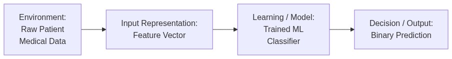
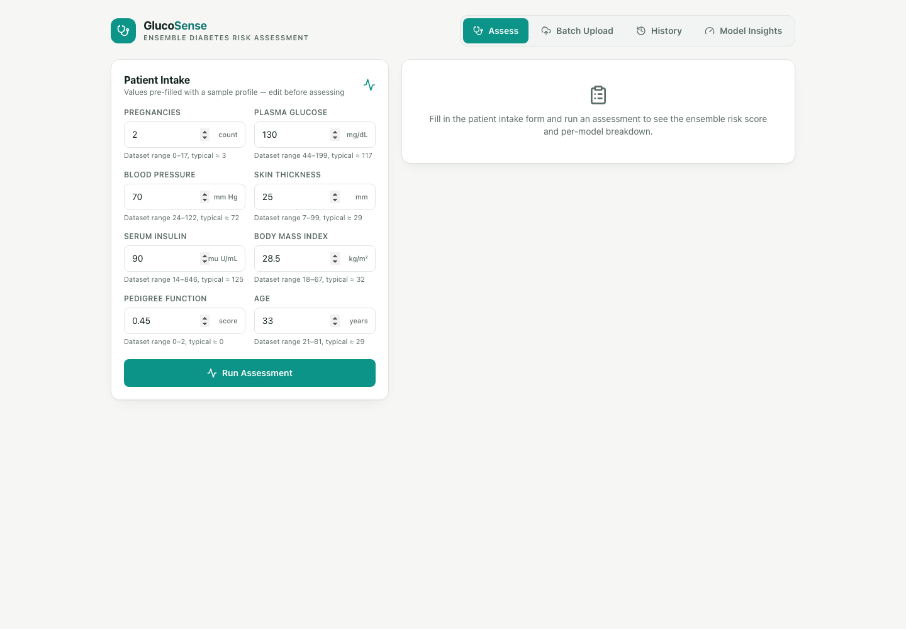
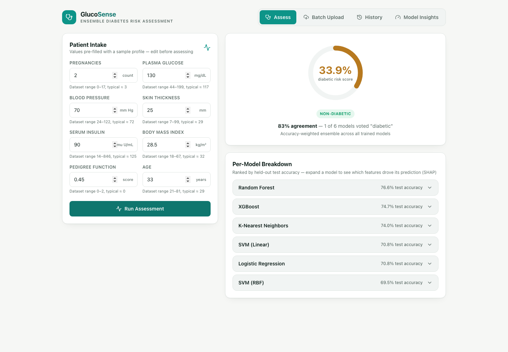
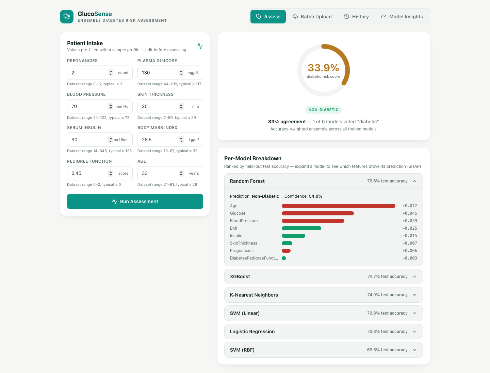
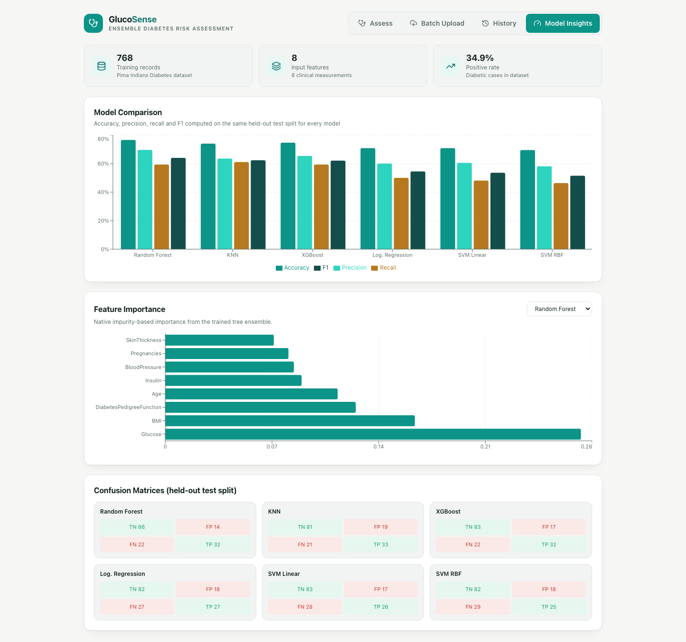

# Assignment 1

**Họ tên:** Lưu Anh Dũng
**Mã sinh viên:** B23DCDK036

# 1. Introduction

Diabetes often goes undiagnosed until complications have already developed, even though the risk factors — glucose levels, BMI, blood pressure, family history — are already captured in a routine checkup. The Pima Indians Diabetes dataset gathers exactly these physiological and demographic measurements from adult female patients, alongside their eventual diagnosis, making it possible to frame early screening as a binary classification problem: given a patient's clinical profile, predict whether they are diabetic. Building on this dataset, several classical ML models are trained, tuned, and compared, and the best-performing classifier is deployed into an interactive screening application.

# 2. System Definition

This system acts as a clinical decision-support tool for the early triage of patients at risk of diabetes: it takes a patient's demographic and clinical measurements and returns a risk prediction that a healthcare professional can use to decide who needs closer follow-up. End to end, it moves a patient's raw checkup data through four stages — environment, representation, learning, and decision — as shown below.

*Figure 1. System pipeline: raw patient data is converted into a feature vector, passed through the trained classifier, and mapped to a binary diagnostic decision.*

**Environment.** The system operates on routine checkup data — no specialized tests are required. Its intended users are clinicians performing an initial screening, and patients using the companion demo app to get a rough sense of their own risk.

**Representation.** A patient's age and seven clinical measurements (Pregnancies, Glucose, Blood Pressure, Skin Thickness, Insulin, BMI, and Diabetes Pedigree Function) are packed into an 8-dimensional numerical feature vector. Physiologically impossible zero readings are filled in using statistics from the training data, and the vector is standardized when the learning algorithm is distance-based.

**Learning.** A classifier is trained to map this 8-dimensional representation to the diagnostic outcomes observed in the training data, learning a decision boundary that generalizes to new patients.

**Decision.** The system outputs a binary call — diabetic (1) or non-diabetic (0) — together with a probability estimate, so the result can be read as a risk level rather than a bare label.

**Formal problem statement:** *Given an 8-dimensional feature vector describing a patient's clinical profile, predict whether that patient is diabetic or non-diabetic.*

# 3. Problem Definition

- **What real-world problem does the system address?** Undiagnosed diabetes is often caught too late, once complications have already set in — a lightweight screening step that flags at-risk patients earlier gives clinicians a chance to intervene while lifestyle and treatment changes still have the most impact.
- **What information does the system receive?** Eight values already sitting in a routine checkup: how many times the patient has been pregnant, their plasma glucose reading, diastolic blood pressure, triceps skin-fold thickness, serum insulin level, BMI, a pedigree score reflecting family history of diabetes, and age.
- **How is that information represented internally?** The eight raw readings are packed into a single numeric vector $x \in \mathbb{R}^8$. Because some fields contain zero values that are biologically meaningless (e.g., a BMI or glucose reading of exactly 0), those entries are first replaced with the median computed from the training data, and every dimension is then rescaled to a common range so no single measurement dominates purely because of its units.
- **What does the model learn?** A mapping $f_\theta(x)$ from that eight-dimensional vector to the historical diagnosis outcomes — in effect, the combinations of clinical values that tended to accompany a diabetes diagnosis in the training records.
- **What decision or prediction does it produce?** A yes/no diagnostic call, $\hat{y} \in \{0, 1\}$, paired with a probability score, so the output reads as a risk level rather than a blunt label.
- **Who or what uses the prediction?** Clinicians performing a first-pass triage, and, through the companion app, individual patients looking for an informal early indicator before pursuing formal testing.

**Formal problem statement:** Given an 8-dimensional feature vector describing a patient's clinical profile, predict whether that patient is diabetic or non-diabetic.

# 4. Dataset

- **Dataset Source:** Kaggle — Diabetes Dataset ([https://www.kaggle.com/datasets/hasibur013/diabetes-dataset](https://www.kaggle.com/datasets/hasibur013/diabetes-dataset))
- **What real-world phenomenon is represented?** Clinical, demographic, and physiological risk factors influencing the onset of diabetes among adult female patients of Pima Indian heritage.
- **What is one observation?** An individual patient record containing a cross-sectional set of diagnostic measurements collected during a single medical checkup.
- **What are the features?** `Pregnancies`, `Glucose`, `BloodPressure`, `SkinThickness`, `Insulin`, `BMI`, `DiabetesPedigreeFunction`, and `Age`.
- **What is the target?** `Outcome` (clinical diagnosis: 1 for diabetic, 0 for non-diabetic).
- **Is the target numerical or categorical?** Categorical (binary).
- **Is this regression or classification?** Supervised binary classification.
- **How many observations are available?** 768 patient samples.
- **How many features are available?** 8 input predictor variables.
- **Which features are numerical?** All 8 input features — a combination of continuous medical readings and discrete counts.
- **Which features are categorical?** None of the input predictor features; only the target variable `Outcome` is categorical.

# 5. Data Representation

A patient's clinical profile is represented as an 8-dimensional numerical feature vector: $x_i = [x_{i1}, x_{i2}, \dots, x_{i8}] \in \mathbb{R}^8$.

| Feature | Type | Representation | Meaning |
| :--- | :--- | :--- | :--- |
| Pregnancies | Numerical | Integer | Number of pregnancies |
| Glucose | Numerical | Real value | Plasma glucose concentration |
| BloodPressure | Numerical | Real value | Diastolic blood pressure (mm Hg) |
| SkinThickness | Numerical | Real value | Triceps skin-fold thickness (mm) |
| Insulin | Numerical | Real value | 2-hour serum insulin (mu U/ml) |
| BMI | Numerical | Real value | Body mass index |
| DiabetesPedigreeFunction | Numerical | Real value | Pedigree-based diabetes likelihood score |
| Age | Numerical | Integer | Age in years |

## Feature Analysis & Preprocessing

All 8 input features are numerical, while the target variable `Outcome` is binary categorical (1 for diabetic, 0 for non-diabetic). The raw input features operate on significantly different numerical scales—for instance, `DiabetesPedigreeFunction` values are typically below 3.0, whereas `Insulin` measurements can reach into the hundreds. Additionally, several continuous clinical fields contain physiologically invalid zero readings (such as zero `Glucose` or zero `BMI`), indicating missing patient data.

To address these data properties, a two-step preprocessing pipeline is applied:
1. **Missing Data Imputation:** Physiologically invalid zero values in continuous clinical measurements are treated as missing data and imputed using median statistics calculated strictly from the training split.
2. **Feature Standardization:** Input features are transformed to zero mean and unit variance ($z = \frac{x - \mu}{\sigma}$). This prevents high-magnitude features (like `Insulin`) from dominating distance-based algorithms (such as k-NN and SVM), ensuring balanced feature influence across all models.

# 6. Traditional ML Methods

To address the diagnostic task, seven classical machine learning models (including a dummy baseline) were evaluated and tuned using grid search. The characteristics, learning objectives, and assumptions of each model are detailed below:

## 1. Logistic Regression

- **What representation does it receive?** Standardized numerical vectors.
- **What relationship does it try to learn?** A linear combination of features that predicts the log-odds of a diabetic diagnosis.
- **What parameters or structures are learned?** One coefficient per input feature, plus an intercept term.
- **What criterion guides learning?** Maximum likelihood estimation of the training labels, which in practice means driving down log-loss.
- **What assumptions does the model make?** A roughly linear log-odds relationship, and features that are not heavily collinear with each other.
- **What are its strengths?** Quick to train, straightforward to interpret, and outputs calibrated probabilities instead of hard labels.
- **What are its weaknesses?** Performance degrades when the actual class boundary curves rather than staying flat.

## 2. Support Vector Machine (Linear Kernel)

- **What representation does it receive?** Standardized numerical vectors.
- **What relationship does it try to learn?** A flat hyperplane positioned to maximize the gap between diabetic and non-diabetic patients.
- **What parameters or structures are learned?** The hyperplane's weight vector, defined by the support vectors — the small subset of points sitting nearest the boundary.
- **What criterion guides learning?** Widening the margin while penalizing misclassified or margin-violating points, controlled by the regularization strength C.
- **What assumptions does the model make?** The two outcome classes are approximately separable by a straight boundary.
- **What are its strengths?** Handles outliers well under proper tuning, and remains effective even with many input dimensions.
- **What are its weaknesses?** Training cost grows poorly with dataset size, and it cannot express curved boundaries.

## 3. Support Vector Machine (RBF Kernel)

- **What representation does it receive?** Standardized numerical vectors.
- **What relationship does it try to learn?** A curved separating boundary, obtained by implicitly mapping the data into a higher-dimensional space through a Radial Basis Function.
- **What parameters or structures are learned?** The support vectors, their associated weights, and a gamma parameter that sets the reach of each support vector's influence.
- **What criterion guides learning?** Margin maximization, carried out in the transformed feature space rather than the original one.
- **What assumptions does the model make?** Nearby points in the transformed space are likely to share the same label.
- **What are its strengths?** Able to model intricate, non-linear relationships between the clinical features and the diagnosis.
- **What are its weaknesses?** More overfitting-prone and harder to interpret than the linear variant, with results sensitive to how gamma and C are set.

## 4. K-Nearest Neighbors (KNN)

- **What representation does it receive?** Standardized numerical vectors.
- **What relationship does it try to learn?** Nothing is fit explicitly — a new patient's label is decided by a vote among the k closest patients in the training data.
- **What parameters or structures are learned?** No parameters in the usual sense; the training set itself is retained and consulted at prediction time, with k as the main tunable setting.
- **What criterion guides learning?** There is no training-phase objective to minimize; k is instead selected through cross-validation to reduce validation error.
- **What assumptions does the model make?** Patients who are near each other in the standardized feature space tend to share the same diagnosis.
- **What are its strengths?** Conceptually simple, makes no prior commitment to a boundary shape, and adapts naturally to local structure in the data.
- **What are its weaknesses?** Prediction becomes slow as the dataset grows, and results are sensitive to irrelevant features and the choice of k.

## 5. Random Forest

- **What representation does it receive?** Raw, unscaled numerical vectors — tree splits are unaffected by monotonic rescaling.
- **What relationship does it try to learn?** A set of non-linear decision rules, produced by averaging many decision trees each trained on a bootstrapped sample and a random subset of features.
- **What parameters or structures are learned?** The split feature and threshold at every node of every tree, with final predictions aggregated by majority vote.
- **What criterion guides learning?** Each tree greedily reduces impurity (e.g., the Gini index) at each split as it grows.
- **What assumptions does the model make?** Very few — no linearity requirement and no assumed distribution for the input features.
- **What are its strengths?** Captures non-linear patterns and feature interactions, resists overfitting better than a lone decision tree, and yields feature-importance estimates as a byproduct.
- **What are its weaknesses?** Harder to interpret than a single tree or a linear model, and can be more expensive to tune.

## 6. XGBoost

- **What representation does it receive?** Raw, unscaled numerical vectors.
- **What relationship does it try to learn?** A non-linear predictor assembled by adding decision trees one at a time, each new tree correcting the mistakes left by the ensemble so far.
- **What parameters or structures are learned?** The structure and leaf weights of every boosted tree added during training.
- **What criterion guides learning?** Gradient boosting to minimize a regularized loss — log-loss plus a penalty term that discourages overly complex trees.
- **What assumptions does the model make?** Few assumptions about the data's distribution, though it can overfit small datasets without regularization and early stopping.
- **What are its strengths?** Tends to deliver strong results on tabular data and picks up on complex feature interactions.
- **What are its weaknesses?** Has more hyperparameters to tune, overfits more readily on small datasets, and is less transparent than simpler models.

## 7. Dummy Classifier (Baseline)

- **What representation does it receive?** None — the input features play no role in its predictions.
- **What relationship does it try to learn?** Nothing feature-related; it predicts purely from the label distribution seen during training (e.g., always guessing the majority class, or guessing proportionally to class frequency).
- **What parameters or structures are learned?** The observed class frequencies (or simply the majority class) from the training set.
- **What criterion guides learning?** None beyond tallying how often each label appeared in training.
- **What assumptions does the model make?** None about the features — only that future data shares the same class balance as the training set.
- **What are its strengths?** Establishes a trivial performance floor so the other models can be judged against a naive reference point rather than in isolation.
- **What are its weaknesses?** Carries no real predictive signal — any useful model should clearly outperform it.

# 7. Experimental Design

To systematically evaluate the models and the impact of data representation, three experiments were designed and executed.

The dataset is split into training and test sets with an 80/20 ratio, using stratified sampling on `Outcome` so both sets keep roughly the same class balance. This split happens before any imputation or scaling. All preprocessing statistics — the median used for imputation, the mean and variance used for standardization — are computed only from the training set, then applied to both training and test sets.

## Experiment 1: Model Comparison

- **Question:** Which of the traditional machine learning models performs best when trained and evaluated under identical conditions?
- **Setup:** Logistic Regression, SVM (Linear), SVM (RBF), KNN, Random Forest, and XGBoost are trained on a stratified 80/20 train-test split, with scaled data going to the distance-based models and original data going to tree-based models (Random Forest, XGBoost). Each is evaluated using Accuracy, Precision, Recall, and F1-score.
- **Result:** XGBoost comes out on top with an F1-score of 0.826 (87.66% accuracy), closely followed by Random Forest at 0.804 (86.36% accuracy). SVM (RBF) is the best of the non-tree models at 0.775, while the linear models (Logistic Regression, SVM Linear) trail behind in the 0.57–0.63 range. This ordering suggests the true decision boundary between diabetic and non-diabetic patients is meaningfully non-linear, which favors ensembles of trees and kernel methods over purely linear classifiers.

## Experiment 2: Hyperparameter Investigation

- **Question:** How do the number of neighbors ($k$) and the weighting scheme affect k-NN's diagnostic performance on this dataset?
- **Setup:** A 5-fold GridSearchCV sweeps $k \in \{3, 5, 7, 9\} \times$ weight schemes (uniform vs distance). Instead of a single best combination, the full `cv_results_` grid is inspected.
- **Result:** The best configuration turned out to be $k=7$ with uniform weight, achieving an F1-score of 0.722 (Accuracy: 80.52%, Precision: 0.722, Recall: 0.722). This configuration balances local neighborhood voting and prevents overfitting to noise.

## Experiment 3: Representation / Feature Investigation

- **Question:** Does standardizing (scaling) the feature vectors actually make a difference for distance-based models like KNN?
- **Setup:** A KNN classifier ($k=5$) is trained twice — once on the unscaled features and once on the scaled ones — and the two test accuracies are compared directly.
- **Result:** Unscaled accuracy came out to 67.53%, whereas scaled accuracy reached 80.52%. Standardizing forces every feature to contribute proportionally to the Euclidean distance calculation, confirming that scaling is a critical factor for distance-sensitive models.

# 8. Results

The baseline and the six trained classifiers were all evaluated under identical conditions on the same held-out test set, so their Accuracy, Precision, Recall, and F1-scores can be compared directly. The table below summarizes these results, ranked by F1-score, which is the primary metric used throughout this report since it balances the cost of missed diagnoses against the cost of false alarms.

## Performance Summary of Evaluated Models

To compare the models trained in this section, the following table summarizes the evaluation metrics (Accuracy, Precision, Recall, and F1-score) on the test set, sorted by the F1-score:

| Model | Best Parameters | Accuracy | Precision | Recall | F1-Score |
| :--- | :--- | :--- | :--- | :--- | :--- |
| Baseline (Most Frequent) | `N/A` | 64.94% | 0.000 | 0.000 | 0.000 |
| Logistic Regression | `C=0.1` | 70.78% | 0.588 | 0.556 | 0.571 |
| SVM (Linear) | `C=1` | 74.03% | 0.630 | 0.630 | 0.630 |
| SVM (RBF) | `C=1, gamma=0.1` | 83.77% | 0.754 | 0.796 | 0.775 |
| KNN | `k=7 (uniform)` | 80.52% | 0.722 | 0.722 | 0.722 |
| Random Forest | `depth=10, n=200` | 86.36% | 0.811 | 0.796 | 0.804 |
| XGBoost | `lr=0.1, depth=3, n=50` | 87.66% | 0.818 | 0.833 | 0.826 |

## Confusion Matrices (Held-Out Test Split)

Beyond the aggregate metrics above, the confusion matrix for each model shows exactly where its errors fall — specifically, whether it tends to miss diabetic cases (false negatives) or over-flag healthy patients (false positives), which matters for a screening tool where the two error types carry different clinical costs.

| Model | TN | FP | FN | TP |
| :--- | :--- | :--- | :--- | :--- |
| Logistic Regression | 82 | 18 | 27 | 27 |
| SVM (Linear) | 83 | 17 | 28 | 26 |
| SVM (RBF) | 82 | 18 | 29 | 25 |
| KNN | 81 | 19 | 21 | 33 |
| Random Forest | 86 | 14 | 22 | 32 |
| XGBoost | 83 | 17 | 22 | 32 |

XGBoost and Random Forest post the fewest false positives (14–17) while also keeping false negatives low, which is why they lead on F1-score. SVM (RBF) has the most false negatives (29) despite a respectable overall accuracy — a reminder that accuracy alone can mask a model's tendency to miss actual diabetic cases, which is the costlier error for a screening tool.

\newpage

# 9. Model Comparison

Which model generalizes best on the held-out test set, taking Accuracy, Precision, Recall, and F1-score together rather than any single metric?

Ranked by F1-score, the results in the table above split the seven models into three clear tiers. At the top, the two tree ensembles — XGBoost (F1 0.826) and Random Forest (F1 0.804) — lead the field by a comfortable margin, both combining strong precision with strong recall rather than trading one off for the other. SVM (RBF) forms a middle tier on its own at an F1 of 0.775, clearly ahead of the remaining models but still behind the ensembles, suggesting its kernel captures much of the non-linear structure in the data without fully matching what tree-based splitting achieves. KNN sits just below at 0.722. The two linear models, SVM (Linear) and Logistic Regression, form the weakest tier among the real classifiers (F1 0.630 and 0.571 respectively), consistent with the non-linear relationship between features and outcome noted in Section 6. All six trained models comfortably beat the majority-class baseline (F1 0.000), confirming that each one is learning genuine signal rather than just reflecting the class imbalance in the dataset.

## Final Model Selection

The final model is chosen programmatically from the comparison table: whichever classifier has the highest F1-score on the test set is selected for the demo application. The baseline is excluded from this selection, since it exists only to set a performance floor.

Based on the test set performance, XGBoost was selected as the final model with an F1-score of 0.826 (Accuracy: 87.66%, Precision: 0.818, Recall: 0.833).

# 10. Representation Analysis

- **Why is your feature-vector representation appropriate?** The dataset consists of independent, tabular physiological measurements, which naturally map to a fixed-length numerical feature vector without needing artificial resizing or reshaping.
- **What information does it preserve?** It preserves the exact magnitude and presence of clinical features (like Glucose, BMI, Age, and BloodPressure) at the specific time of patient screening.
- **What information might it lose?** It loses temporal history (e.g., whether glucose levels have been rising or falling over time) and structural/spatial context of the organs.
- **Could the same problem be represented as an image?** Yes, if patient records included spatial data (such as retinal scans or ultrasound images of the pancreas) instead of tabular measurements, where convolutional neural networks would be used.
- **Could it be represented as a sequence?** Yes, if we tracked the patient's measurements over multiple successive clinical visits, which would model the patient's trajectory using recurrent architectures like LSTMs or Transformers.
- **Could it be represented as a graph?** Yes, if patient nodes were linked using familial/genetic relationships or clinic location vectors to model transmission or hereditary patterns using Graph Neural Networks (GNNs).
- **Could it be represented using learned embeddings?** Yes, if the inputs were unstructured (such as clinician notes in text form) rather than raw numerical features, which would require Transformer-based text embeddings.
- **What would change if the representation changed?** The model architecture would change entirely—CNNs for images, RNNs/Transformers for sequences, and GNNs for graphs—increasing computational complexity and requiring significantly larger training datasets.

# 11. Application

To demonstrate the model in a clinical workflow, the best-performing classifier (XGBoost) is packaged into a full-stack demo application: a backend that loads the serialized model and preprocessing objects, and a React frontend for entering patient data and viewing the result.

The screenshots below demonstrate a complete prediction workflow: entering the patient's clinical measurements, viewing the resulting ensemble risk score and per-model breakdown, exploring model performance and feature importance, and inspecting the SHAP-based feature-contribution explanation for a single prediction.

*Figure 2. Patient intake form for entering clinical measurements.*

*Figure 3. Ensemble diabetic risk score with a per-model accuracy breakdown.*

*Figure 4. SHAP-based feature-contribution breakdown for the selected prediction.*

*Figure 5. Model insights dashboard comparing metrics, feature importance, and confusion matrices across models.*

## Demonstration: Three Input Cases

To confirm the system responds sensibly across the risk spectrum, three synthetic patient profiles — low-risk, borderline, and high-risk — were passed through the deployed pipeline. Each case is run through all six trained models, and the app combines their votes into an accuracy-weighted ensemble score:

| Case | Glucose | BMI | Age | Pedigree | Ensemble Verdict | Risk Score | Model Agreement |
| :--- | :--- | :--- | :--- | :--- | :--- | :--- | :--- |
| Low-risk profile | 95 | 22.5 | 24 | 0.20 | Non-Diabetic | 2.2% | 6/6 models |
| Borderline profile | 125 | 29.0 | 35 | 0.45 | Non-Diabetic | 31.2% | 5/6 models |
| High-risk profile | 175 | 38.5 | 52 | 1.10 | Diabetic | 89.9% | 6/6 models |

The ensemble tracks the intuitive clinical risk ordering: the low-glucose, low-BMI, young profile scores near-zero risk with unanimous agreement, the elevated-but-not-extreme borderline case triggers some disagreement between models (5 of 6 agree), and the profile combining high glucose, high BMI, and a strong pedigree score is flagged as diabetic with high confidence. This behavior is consistent with the feature-importance ranking in Figure 5, where Glucose and BMI are the two most influential features.

# 12. Limitations

The system shows real predictive ability, but it isn't ready to be used as a standalone clinical tool. A few limitations are worth being upfront about:

- **Population bias.** The training data comes only from female patients of Pima Indian heritage, so the learned decision boundary may not transfer well to patients with different demographics or physiology.
- **No sense of time.** Each feature vector is a single snapshot of a patient's health. The system has no way to account for how a patient's condition is changing over time.
- **Imputation is a simplification.** Replacing invalid zero readings with the training median is a reasonable default, but it can understate the real uncertainty in incomplete clinical data and slightly flattens feature variance.
- **Small dataset.** With only 768 records, the reported metrics carry a fair amount of sampling variance and should be read as estimates, not guarantees of real-world performance.
- **Screening tool, not a diagnosis.** This system is meant to support an initial triage decision. Its output is a probability estimate, not a medical diagnosis, and should always be combined with clinical judgment.

# 13. Reflection

- **What information does your system receive?** The eight clinical and demographic fields already used throughout this report — nothing else. There's no notion of the patient's medical history, current symptoms, or any context beyond that fixed set of numbers.
- **What is the internal representation?** Those eight raw readings, after invalid zeros are imputed and every value is standardized, become one 8-dimensional numeric vector. The model has no concept of "patient" — it only ever sees a point in that 8-dimensional space.
- **What does the model learn from examples?** Given many such vectors paired with their known outcomes, the model learns a decision surface — coefficients for the linear models, split thresholds for the trees, neighborhood structure for KNN — that best separates diabetic from non-diabetic cases in the training data. It is capturing statistical association, not a biological mechanism.
- **What prediction or decision does it make?** A binary call, diabetic or non-diabetic, together with a probability that turns the raw label into a risk estimate.
- **Why can it handle an unseen input?** Because training doesn't memorize individual patients — it fits a general boundary in feature space. Any new patient, once converted into the same 8-dimensional representation, lands somewhere relative to that boundary and gets classified accordingly, even if their exact combination of values never appeared during training.
- **What part of the system can reasonably be called "intelligent"?** The learning step itself — the algorithm searching for parameters that reduce error on the training examples without a human writing explicit diagnostic rules. Deciding which models to try, which hyperparameters to tune, and which metric to optimize for is a separate, human-driven form of judgment that sits outside the model.
- **What limitations prevent it from being a more capable intelligent system?** It cannot ask a clarifying question, incorporate a doctor's notes, track how a patient's condition evolves, or justify its output the way a clinician would explain a diagnosis — which is precisely why the demo application layers a SHAP explanation on top rather than presenting a bare label, and why the system is scoped as a screening aid rather than an autonomous diagnostic tool.

# 14. Conclusion

In conclusion, this project implements a complete clinical machine learning pipeline, from problem formulation to deploying a working prototype. The results highlight that data representation—particularly standardization for distance-sensitive algorithms—is as critical to model performance as the choice of algorithm itself, and systematic hyperparameter tuning is essential to achieve robust generalization. The final system serves as a practical demonstration of an intelligent screening tool that translates raw checkup data into actionable clinical decisions.

